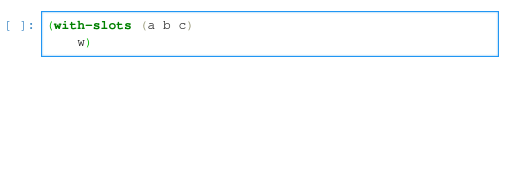

# common-lisp-jupyter

[![Binder][mybinder-badge]][mybinder]
[![Build Status][ci-badge]][ci]

A Common Lisp kernel for Jupyter along with a library for building Jupyter
kernels, based on [Maxima-Jupyter][] by Robert Dodier which was based on
[cl-jupyter][] by Frederic Peschanski.

Installation instructions can be found in the `docs` directory or at 
[install][].

## Features

- Code inspection, code completeness checking, and code completion.

- JupyterLab debugger support

- Markdown, PDF and other MIME rendering

- Automatic detection of MIME types for files

- Emulation of a Lisp REPL including setting of the REPL variables `-`, `+`, 
  `++`, `+++`, `*`, `**`, `***`, `/`, `//` and `///`

- Lisp interface to core IPython widgets is included in the `jupyter-widgets`
  package. Additional widgets are available in [cytoscape-clj][], [kekule-clj][],
  [ngl-clj][], and [sheet-clj][]

### Completion of functions/macros

Autocompletion of function and macro names is available via the tab key.

### Symbol completion

Autocompletion of symbols is also available via the tab key. The symbol type is 
displayed in the dropdown list.

### Indentation

Pressing tab while the carat is on a parenthesis while result in all forms in 
the cell being auto-indented.

### Inspection

Pressing shift-tab while the carat is on a symbol will show context sensitive
help.

## Examples

- [about.ipynb][] — Simple examples including displaying images.
- [widgets.ipynb][] — Basic widget examples.
- [julia.ipynb][] — A Julia set explorer.

<!--refs-->

[about.ipynb]: http://nbviewer.jupyter.org/github/yitzchak/common-lisp-jupyter/blob/master/examples/about.ipynb
[ci-badge]: https://github.com/yitzchak/common-lisp-jupyter/workflows/ci/badge.svg
[ci]: https://github.com/yitzchak/common-lisp-jupyter/actions/
[cl-jupyter]: https://github.com/fredokun/cl-jupyter/
[install]: https://yitzchak.github.io/common-lisp-jupyter/install
[cytoscape-clj]: https://github.com/yitzchak/cytoscape-clj
[julia.ipynb]: http://nbviewer.jupyter.org/github/yitzchak/common-lisp-jupyter/blob/master/examples/julia.ipynb
[Jupyter]: https://jupyter.org/
[kekule-clj]: https://github.com/yitzchak/kekule-clj
[Maxima-Jupyter]: https://github.com/robert-dodier/maxima-jupyter/
[mybinder-badge]: https://mybinder.org/badge_logo.svg
[mybinder]: https://mybinder.org/v2/gh/yitzchak/common-lisp-jupyter/master?urlpath=lab
[nbviewer]: http://nbviewer.jupyter.org
[ngl-clj]: https://github.com/yitzchak/ngl-clj
[sheet-clj]: https://github.com/yitzchak/sheet-clj
[widgets.ipynb]: http://nbviewer.jupyter.org/github/yitzchak/common-lisp-jupyter/blob/master/examples/widgets.ipynb

